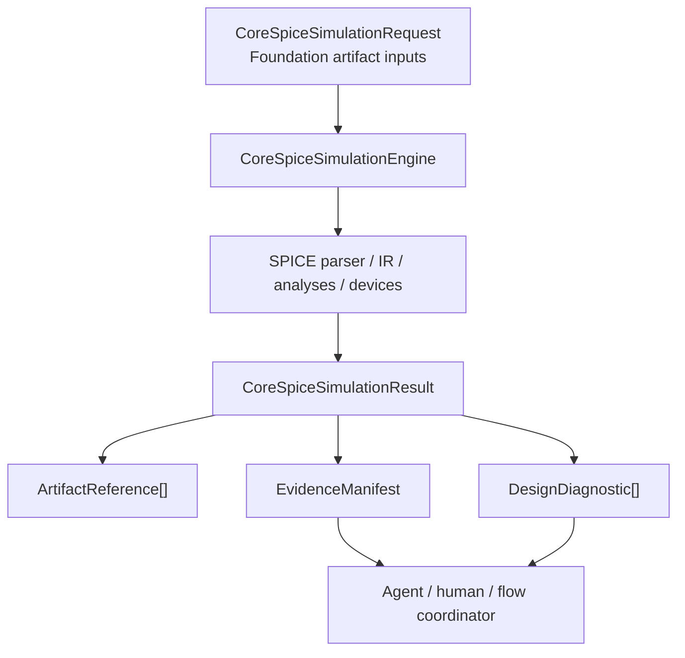

# CoreSpice Design Contract

## Responsibility

CoreSpice is the independently usable simulation domain package. It owns
SPICE parsing and lowering, circuit IR, device models, numerical analyses,
optoelectronic co-simulation, photonic GPU execution, waveform conversion, and
SPICE-compatible I/O.

It does not own project state, flow ordering, tool trust, human approval, or
physical signoff semantics.

## CircuiteFoundation integration

The package depends on `CircuiteFoundation` and re-exports it from the
`CoreSpice` umbrella target. The shared boundary is intentionally small:

- `CoreSpiceSimulationRequest` carries digest-bearing input
  `ArtifactReference` values and optional configuration, revision, and random
  seed digests.
- `CoreSpiceSimulationResult` carries output artifacts, typed diagnostics, and
  an `EvidenceManifest` built from caller-supplied `ExecutionProvenance`.
- `CoreSpiceSimulationEngine` refines `CircuiteFoundation.Engine` for an
  asynchronous simulation entry point.

The existing analysis types and synchronous setup APIs remain domain-owned.
They may be composed by a future engine implementation, but their numerical
algorithms must not move into Foundation and must not silently invent artifact
digests or provenance.

## Ownership boundary

| Concern | Owner |
|---|---|
| Artifact, provenance, evidence, and diagnostic vocabulary | CircuiteFoundation |
| SPICE syntax, netlist lowering, circuit IR | CoreSpice |
| Device physics and numerical solvers | CoreSpice |
| Waveform serialization and SPICE-compatible formats | CoreSpice |
| Process timeout and external tool cleanup | SignoffToolSupport |
| Tool qualification and trust gates | ToolQualification / DesignFlowKernel |
| Project/run persistence and human approval | Xcircuite / DesignFlowKernel |
| DRC, LVS, PEX, STA, EM/IR, and physical signoff rules | Domain signoff engines |

## Deliberate non-goals

- `CoreSpice` does not become a project or run ledger.
- `CoreSpice` does not qualify an external simulator, PDK, or foundry deck.
- Foundation does not contain SPICE-specific requests, waveform types, or
  device models.
- A simulation result is evidence for review; it is not a signoff approval.

## Concrete engine boundary

`CoreSpiceSimulationEngineAdapter` is the concrete Foundation-facing engine.
It delegates domain execution to an injected `CoreSpiceSimulationExecuting`
implementation, checks cooperative cancellation, records the request inputs
and reproducibility fields in `ExecutionProvenance`, and exposes verified
artifact references and structured diagnostics from the execution.

The injected executor remains responsible for parsing, analysis selection,
artifact materialization, artifact verification, and typed domain errors.
Existing CLI envelopes and I/O formats remain compatibility surfaces until a
deliberate migration is documented.
