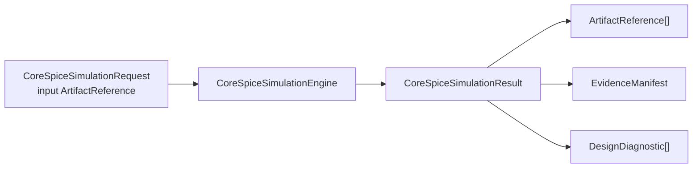

# CoreSpice

A SPICE circuit simulator written in Swift. Supports electrical circuit analysis, optoelectronic device co-simulation, and photonic mesh computation on Metal GPU.

## CircuiteFoundation boundary

CoreSpice owns SPICE parsing, circuit IR, device models, numerical analysis, and
waveform I/O. Cross-package execution evidence uses
`CircuiteFoundation`'s artifact and provenance types:



`DefaultCoreSpiceSimulationEngine` is the concrete asynchronous execution
boundary for a domain executor that composes the existing analysis APIs. Existing analysis
types remain independent and no simulator algorithm moves into the shared
Foundation package. `CoreSpiceSimulationResult` is the canonical hand-off for
artifact integrity, provenance, and structured diagnostics.

Native Level 1/2/3 execution is a supported-model simulation and regression
capability. It is not a foundry compact-model signoff capability. The
machine-readable [production qualification contract](validation/production-qualification-contract.json)
requires a digest-bound external foundry-model simulator, an independent
oracle, the exact PDK/model deck, and `ToolQualification` evidence before a
production flow can accept simulation results.

**Requirements**: macOS 26+, Swift 6.3

## Xcircuite integration

[`Xcircuite`](https://github.com/1amageek/Xcircuite) is the umbrella runtime
that invokes CoreSpice through a simulation stage executor and persists
waveforms, measurements, diagnostics, and evidence in the shared run ledger.
CoreSpice remains independently usable and owns SPICE parsing, device models,
numerical analysis, and waveform I/O.

## Features

### Analyses

| Analysis | Description |
|----------|-------------|
| DC Operating Point | Newton-Raphson with Gmin/source stepping fallback |
| DC Sweep | Parameter sweep of source values |
| AC Small-Signal | Frequency-domain linearized analysis |
| Transient | Time-domain with adaptive timestep (BE/Trapezoidal, LTE control) |
| Noise | Output/input-referred spectral density, integrated RMS noise |
| Transfer Function | Small-signal gain, input/output impedance |
| Pole-Zero | Poles and zeros via generalized eigenvalue (LAPACK QZ) |
| Fourier | Harmonic decomposition and THD from transient results |
| Sensitivity | Per-parameter DC sensitivity via finite difference |
| Monte Carlo | Repeated analysis with Gaussian/uniform parameter variations |

### Devices

**Electrical**

| Type | Devices |
|------|---------|
| Passive | Resistor, Capacitor, Inductor |
| Sources | Voltage/Current (DC, Pulse, Sine, PWL) |
| Controlled Sources | VCVS, VCCS, CCVS, CCCS |
| MOSFET | NMOS/PMOS Level 1 plus empirical Level 2/3 short-channel extensions |
| BJT | NPN, PNP (Ebers-Moll with Early effect) |
| Diode | PN junction with breakdown, capacitance, transit time |

**Optoelectronic**

| Type | Description |
|------|-------------|
| Laser Diode | Rate equation model, relaxation oscillation, RIN, temperature dependence |
| LED | Forward-bias emission with external quantum efficiency |
| Photodiode | Responsivity, shot noise, dark current, wavelength dependence |
| EO Modulator | Mach-Zehnder intensity modulator with electrode model |
| Waveguide | Propagation loss and phase shift |
| Splitter | 1x2 optical power splitter |

**Photonic**

| Type | Description |
|------|-------------|
| MZI 2x2 | Mach-Zehnder interferometer block |
| Photonic Mesh 512 | 512-port MZI mesh on Metal GPU |

### I/O

- **Input**: SPICE netlist parser (`.op`, `.dc`, `.ac`, `.tran`, `.noise`, `.tf`, `.pz`, `.four`, `.sens`, `.mc`)
- **Output**: RAW (ngspice), CSV, PSF (Cadence) with variable filtering and compression

## Installation

```swift
dependencies: [
    .package(url: "https://github.com/1amageek/CoreSpice", from: "0.1.0")
]
```

```swift
.target(name: "YourTarget", dependencies: [
    .product(name: "CoreSpice", package: "CoreSpice"),
    .product(name: "CoreSpiceIO", package: "CoreSpice"),
])
```

## Quick Start

### Circuit Definition

```swift
import CoreSpice

var netlist = Netlist()
try netlist.addInstance(name: "V1", typeName: "vsource", nodes: ["in", "0"],
                        parameters: ["v": .real(5.0)])
try netlist.addInstance(name: "R1", typeName: "resistor", nodes: ["in", "out"],
                        parameters: ["r": .real(1000)])
try netlist.addInstance(name: "R2", typeName: "resistor", nodes: ["out", "0"],
                        parameters: ["r": .real(1000)])

let ir = try netlist.build()
let compiler = StandardCompiler()
let plan = try compiler.compile(ir: ir)

let registry = DeviceRegistry.standard()
var context = BindingContext(variableMap: plan.topology.variableMap,
                             matrixDimension: plan.topology.dimension)
let devices = try ir.instances.map { instance in
    try registry.descriptor(for: instance.typeName)!
        .bind(instance: instance, context: &context)
}
```

### DC Analysis

```swift
let solver = SparseLUSolver()
let dc = DCAnalysis()
let result = try await dc.run(plan: plan, devices: devices, solver: solver,
                               observer: nil, cancellation: CancellationToken())

let vOut = result.voltage(at: netlist.node("out"))  // 2.5V
```

### AC Analysis

```swift
let ac = ACAnalysis(sweep: .decade(start: 1, stop: 1e6, pointsPerDecade: 10))
let acResult = try await ac.run(plan: plan, devices: devices, solver: solver,
                                 observer: nil, cancellation: CancellationToken())

let gain = acResult.magnitudeDB(at: outputNode, frequencyIndex: 0)
```

### Transient Analysis

```swift
let tran = TransientAnalysis(config: TransientConfig(stopTime: 1e-3))
let tranResult = try await tran.run(plan: plan, devices: devices, solver: solver,
                                     observer: nil, cancellation: CancellationToken())

let waveform = try tranResult.voltageWaveform(at: outputNode)
```

### Optoelectronic Simulation

```swift
import CoreSpice

var netlist = Netlist()
try netlist.addInstance(name: "V1", typeName: "vsource", nodes: ["vcc", "0"],
                        parameters: ["v": .real(1.5)])
try netlist.addInstance(name: "RS", typeName: "resistor", nodes: ["vcc", "la"],
                        parameters: ["r": .real(10.0)])
try netlist.addInstance(name: "LD1", typeName: "laser", nodes: ["la", "0"],
                        opticalNodes: ["opt"],
                        parameters: ["ith": .real(20e-3), "slope_eff": .real(0.3)])
try netlist.addInstance(name: "PD1", typeName: "photodiode", nodes: ["pd", "0"],
                        opticalNodes: ["opt"],
                        parameters: ["resp": .real(0.8)])
try netlist.addInstance(name: "RL", typeName: "resistor", nodes: ["pd", "0"],
                        parameters: ["r": .real(1e3)])
```

### SPICE Netlist

```swift
import CoreSpiceIO

let source = """
RC Lowpass Filter
V1 in 0 AC 1
R1 in out 1k
C1 out 0 1u
.ac dec 10 1 1meg
.end
"""

let netlist = try await SPICEIO.parse(source).get()
let circuit = try SPICEIO.lower(netlist, configuration: .default)
```

### Exporting Results

```swift
import CoreSpiceIO

let waveform = WaveformData.from(transientResult: result,
                                  topology: plan.topology, title: "Simulation")

try await SPICEIO.exportToRAW(waveform, path: "output.raw")
try await SPICEIO.exportToCSV(waveform, path: "output.csv")
try await SPICEIO.exportToPSF(waveform, path: "output.psf")
```

## CLI

See [CoreSpiceCLI README](Sources/CoreSpiceCLI/README.md) for full usage, supported SPICE syntax, and examples.

```bash
swift build -c release --product corespice
```

**Batch mode**:
```bash
corespice -b circuit.cir -r output.raw --csv output.csv
corespice -b circuit.cir --tran 1n 100n -r output.raw
corespice -b circuit.cir --ac dec 10 1 1meg --psf output.psf
corespice -b circuit.cir --dc V1 0 5 0.1 --csv output.csv
```

**Structured results for agents** (`--json`): batch runs emit a single JSON
envelope on stdout — `status: "succeeded"` with analyses, artifact paths,
measurements, and waveform stats, or `status: "failed"` with a stable error
`code`/`stage` (exit code 2). See the
[CoreSpiceCLI README](Sources/CoreSpiceCLI/README.md#structured-run-envelopes---json)
for the schema and the full failure-code table.
```bash
corespice -b circuit.cir --json --csv output.csv
```

**Post-hoc waveform measurement** (`measure`): evaluates `.measure`-grammar
specs against a stored waveform CSV without re-simulating. Supported kinds:
`FIND ... AT=`, `AVG`, `RMS`, `MIN`, `MAX`, `PP`, `INTEG` (with optional
`FROM=`/`TO=`), `RISE_TIME`, `FALL_TIME`, `TRIG`/`TARG` delay, and `WHEN`.
Exit codes match the run envelopes (0 success, 1 text-mode failure, 2 `--json`
failure envelope). See the
[CoreSpiceCLI README](Sources/CoreSpiceCLI/README.md#post-hoc-waveform-measurement-measure).
```bash
corespice -b circuit.cir --csv output.csv
corespice measure --waveform output.csv --measure "tran vfinal FIND V(out) AT=5u" --json
```

**Interactive shell**:
```
corespice> source circuit.cir
corespice> run
corespice> write csv output.csv
```

## Module Structure

```
CoreSpice (umbrella)
├── CoreSpiceIR              Circuit IR: nodes, branches, instances
├── CoreSpiceDevices         Device models and MNA stamping
├── CoreSpiceCompile         Matrix topology, sparse LU solver
├── CoreSpiceAnalysis        10 analysis engines, Newton-Raphson solver
├── CoreSpiceOptoelectronics Laser, LED, photodiode, modulator, waveguide
├── CoreSpiceEvent           Event system and cancellation
└── CoreSpiceBackend         Metal GPU compute

CoreSpiceIO (umbrella)
├── CoreSpiceParserSPICE     SPICE netlist parser
├── CoreSpiceLowering        Netlist to CircuitIR lowering
├── CoreSpiceWaveform        Waveform data IR
└── CoreSpiceExporter*       RAW / CSV / PSF exporters

PluginsPhotonic              512-port MZI mesh (Metal GPU)
```

## License

MIT
