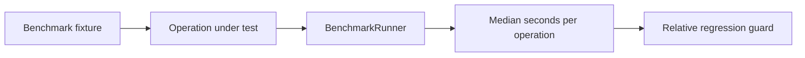

# Benchmarks

CoreSpice benchmarks are active-only checks. They are intentionally not Swift
test targets and must not run as part of normal CI correctness testing. They are
release-mode executables for measuring and guarding the data-flow contracts that
matter to simulator scale:

- lazy waveform projections must stay cheaper than materializing copied data;
- row-major point scans must use borrowed buffers instead of repeated row copies;
- transient-result to waveform conversion must preserve row-major storage.

## Responsibility Split



| Layer | Responsibility |
|---|---|
| `BenchmarkRunner` | Warm up, collect samples, report per-operation timings, and keep checksums live. |
| Fixtures | Build deterministic row-major waveform and transient-result inputs. |
| Benchmark executable | Compare operations by relative cost in the same process when explicitly run. |
| Correctness tests | Validate exact API behavior and zero-copy pointer contracts. |

## Running

Use a timeout even for active benchmarks. The default mode reports performance
metrics and fails only on structural benchmark errors such as missing row-major
storage, invalid checksums, or lost storage sharing:

```bash
perl -e 'alarm 60; exec @ARGV' swift run --package-path Benchmarks -c release corespice-benchmarks
```

The executable prints median, minimum, and maximum microseconds per operation.
Its pass/fail guards use relative ratios rather than absolute wall-clock
thresholds, because absolute timings vary by host and load.

To make relative performance threshold failures return a non-zero status, pass
`--enforce`:

```bash
perl -e 'alarm 60; exec @ARGV' swift run --package-path Benchmarks -c release corespice-benchmarks --enforce
```

Normal CI should keep running correctness tests with `swift test`. Benchmark
evaluation is opt-in and lives in a separate Swift package under `Benchmarks/`,
so root `swift test` does not build or run the benchmark executable.

## Current Coverage

| Benchmark | Guard |
|---|---|
| `waveform.lazyProjection` vs `waveform.materializedProjection` | Lazy projection remains at least 5x cheaper. |
| `waveform.borrowedPointScan` vs `waveform.materializedRowScan` | Borrowed row-major scan is not materially slower than repeated `[[Double]]` materialization. |
| `transient.convertToWaveform` vs `transient.convertAndMaterializeRows` | Conversion remains metadata-dominated and preserves storage sharing. |
