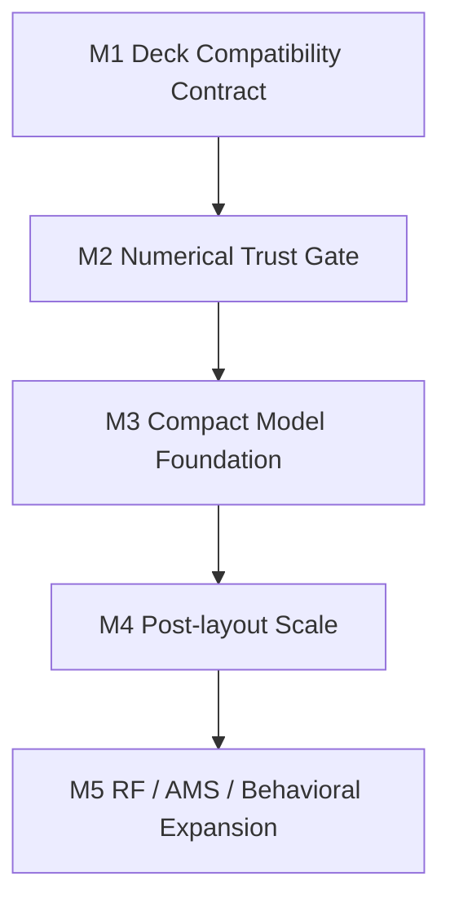

# CoreSpice 5 Completion Plan

CoreSpice is a trust anchor for the local semiconductor design harness. A 5/5 CoreSpice implementation must let layout, timing, PEX, and agent-driven design decisions depend on its results without hiding unsupported physics, parser gaps, or numerical uncertainty.

## Completion Definition

| Axis | 5/5 requirement |
|---|---|
| Deck compatibility | Real SPICE decks can be parsed with `.include`, `.lib`, `.param`, `.func`, `.if/.elseif/.else/.endif`, `.options`, `.temp`, `.ic`, `.nodeset`, `.save`, `.probe`, and `.measure` preserved as structured IR or applied with audit evidence. |
| PDK model fidelity | Foundry-style MOS/BJT/diode model cards are either executed by native compact models or rejected with typed unsupported-model diagnostics before simulation. |
| Numerical robustness | OP/DC/transient convergence uses damping, stepping, timestep control, and method fallback with residual evidence rather than silent divergence or false success. |
| Post-layout scale | Large PEX RC/coupling decks run deterministically, with factorization reuse and explicit performance envelopes. |
| Trust artifacts | Every verification run can emit inputs, options, model coverage, solver residuals, tolerances, and comparison results against external or golden references. |
| Future demand | RF, AMS, behavioral modeling, and compact-model plugin paths have stable extension points even before every feature is complete. |

## Milestones

| Milestone | Scope | Completion gate |
|---|---|---|
| M1 | Parser and lowering preserve deck intent and reject unsupported constructs explicitly. | Parser tests cover include/lib evidence, `.func`, `.probe`, `.save`, `.ic`, `.nodeset`, `.measure`, options, and expression lowering. |
| M2 | Strengthen nonlinear and transient numerical behavior. | Golden ngspice/Xyce comparisons cover OP/DC/tran on nonlinear fixtures, with residual artifacts and no skipped convergence cases in harness tests. |
| M3 | Add compact model path for PDK MOS/BJT/diode cards. | Sky130-style model decks either run through native/OSDI-backed devices or fail before simulation with coverage diagnostics. |
| M4 | Support post-layout PEX scale. | Large RC/coupling decks run within documented time/memory envelopes and match reference transfer/transient metrics. |
| M5 | Add future-facing analyses and co-simulation. | RF/AMS/behavioral APIs are stable, with PSS/HB/S-parameter/behavioral-source test fixtures. |

## M1 Responsibility Split

| Layer | Responsibility |
|---|---|
| `CoreSpiceParserSPICE` | Parse deck syntax into structured `ParsedNetlist` without losing control statements. |
| `CoreSpiceParsedIR` | Represent the deck intent independently from simulator support. |
| `CoreSpiceLowering` | Resolve parameters, user functions, models, and subcircuits into executable `CircuitIR`. |
| `CoreSpiceAnalysis` | Execute only supported analyses with explicit configuration and typed errors. |
| Harness / CLI | Decide whether unresolved controls are allowed for a given run mode. |

## Current M1 Implementation Slice

This slice adds:

| Feature | Status |
|---|---|
| `.func` / `.function` parse | Implemented as structured control statement. |
| User-defined function lowering | Implemented for parameter expressions, with recursion rejected. |
| `.probe` parse | Implemented and preserved. |
| `.save V(...) I(...)` preservation | Improved to keep call-like variable text. |
| `.include` / `.lib` evidence | Preserved even when includes are resolved inline. |
| `.endl` | Recognized to avoid false unsupported-directive failures. |
| `.ic V(node)=value` and `.nodeset V(node)=value` | Implemented and preserved as control evidence. |
| Public parse overload with resolver | Implemented through `SPICEIO.parse(... configuration:fileResolver:)`. |
| `.options` execution bridge | Implemented through `SPICEAnalysisOptions`, mapping supported tolerances and transient options into analysis configuration with warnings for unapplied options. |
| `.measure` execution bridge | Implemented through `SPICEMeasureEvaluator`, producing structured post-analysis measurement results from `WaveformData`. |
| CLI execution intent wiring | Implemented: parsed options configure OP/DC/AC/tran runs and parsed measurements are evaluated after analysis. |
| Deck coverage artifact | Implemented through `SPICEDeckCoverageReport` and CLI `--coverage-json`, classifying parsed items as preserved/applied/supported/warning/blocked. |
| Conditional deck syntax | Implemented through a line-preserving `.if/.elseif/.else/.endif` preprocessor. Inactive branches are blanked before token parsing, invalid syntax in inactive branches cannot leak into parser diagnostics, invalid active conditions fail closed, and branch-selection evidence is recorded in `ParsedNetlist.controls` for coverage artifacts. |

## Remaining M1 Work

| Gap | Required behavior |
|---|---|
| `.lib` nested parser corpus | Add local filesystem tests for nested `.include` inside named `.lib` sections. |
| `.measure` expression support | Add expression-based `WHEN` and expression output variables, or keep failing with typed unsupported-measure errors. |
| behavioral source parse | Parse B-source and nonlinear E/G expressions into a separate unsupported/executable path. |
| model coverage report | Extend deck coverage with compact-model execution coverage once M3 model support is implemented. |
