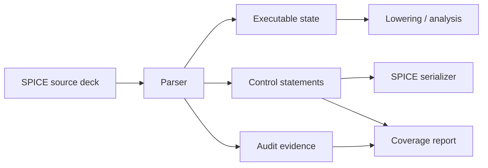

# SPICE Deck Intent Contract

CoreSpice separates parsed deck state by responsibility so execution, serialization,
and audit artifacts do not reinterpret the same field with different meanings.

## State Boundaries

| State | Owner | Meaning |
|---|---|---|
| `ParsedNetlist.parameters` | Lowering | Canonical global parameter environment after parsing. |
| `ParsedNetlist.parameterDefinitions` | Parser / serializer / coverage | Ordered source `.param` declarations with locations. |
| `ParsedNetlistBody.parameters` | Lowering | Canonical local parameter environment for a subcircuit body. |
| `ParsedNetlistBody.parameterDefinitions` | Parser / serializer / coverage | Ordered source `.param` declarations scoped to a netlist or subcircuit body. |
| `ParsedNetlist.controls` | Parser / execution surfaces | Executable or serializable control statements such as options, functions, measurements, output intent, includes, and libraries. |
| `ParsedNetlist.preprocessingEvents` | Conditional preprocessor / coverage | Audit evidence for `.if/.elseif/.else/.endif` branch decisions. |

## Contract

- `controls` must not contain preprocessing-only evidence.
- `controls` must not duplicate canonical maps such as `parameters`.
- Serializers emit `parameterDefinitions` when source definitions exist; otherwise
  they emit the canonical `parameters` map for programmatic netlists.
- Subcircuit-local `.param` declarations live in `ParsedNetlistBody`, are
  serialized inside that body, and are applied only within that subcircuit
  expansion scope.
- Subcircuit-local `.model` declarations live in `ParsedNetlistBody.models` and
  are resolved before global models while that body is being expanded.
- A subcircuit body-local `.param` must not shadow a public subcircuit
  parameter from the `.subckt params:` clause or instance override. Ambiguous
  scope is a lowering error, not a silent override.
- Coverage reports combine executable state, controls, and preprocessing evidence
  explicitly instead of relying on one overloaded collection.
- Unsupported deck intent is preserved as structured unsupported state or fails
  with a typed parser diagnostic. It must not be silently rewritten into a
  different supported construct.

## Numeric Failure Contract

Invalid numeric literals and unknown engineering suffixes are parser errors.
They must never fall back to zero, default transient stop time, default frequency,
or a missing component value.
